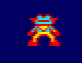

# DESAFIO 1.P12: Pinta un Sprite

¡Enhorabuena! ¡Ya vas a pintar tu primer sprite en código máquina!

Como siempre, copia el código de tu programa debajo. 

Si haces varias versiones para obtener los bonus, puedes copiarlas todas.

# PROGRAMAS

## Desafío: Sprite 16x16 píxeles mínimo
El sprite debe estar más o menos el centro de la pantalla.
```
3E 66 32 97 C3 32 98 C3 3E 9F 32 97 CB 32 98 CB 3E 77 32 96 D3 3E 8F 32 97 D3 3E 1F 32 98 D3 3E EE 32 99 D3 3E 33 32 96 DB 3E 7F 32 97 DB 3E EF 32 98 DB 3E CC 32 99 DB 3E 11 32 96 E3 3E 0F 32 97 E3 32 98 E3 3E 88 32 99 E3 3E FF 32 97 EB 32 98 EB 3E 11 32 96 F3 3E 7C 32 97 F3 3E E3 32 98 F3 3E 88 32 99 F3 3E 23 32 96 FB 3E BE 32 97 FB 3E D7 32 98 FB 3E 4C 32 99 FB 3E 57 32 E6 C3 3E 9F 32 E7 C3 32 E8 C3 3E EA 32 E9 C3 3E EE 32 E6 CB 3E F8 32 E7 CB 3E F1 32 E8 CB 3E 77 32 E9 CB 3E DD 32 E6 D3 3E F3 32 E7 D3 3E FC 32 E8 D3 3E BB 32 E9 D3 3E 32 32 E6 DB 32 E8 DB 3E C4 32 E7 DB 32 E9 DB 3E 32 32 E6 E3 3E C4 32 E9 E3 3E 88 32 E7 E3 32 E7 EB 32 E7 F3 32 E7 FB 3E 11 32 E8 E3 32 E8 EB 32 E8 F3 32 E8 FB 3E FF 32 E6 F3 32 E9 F3 32 E6 FB 32 E9 FB 3E 76 32 E6 EB 3E E6 32 E9 EB 18 FE
```
PC: 4000

# IMAGENES

